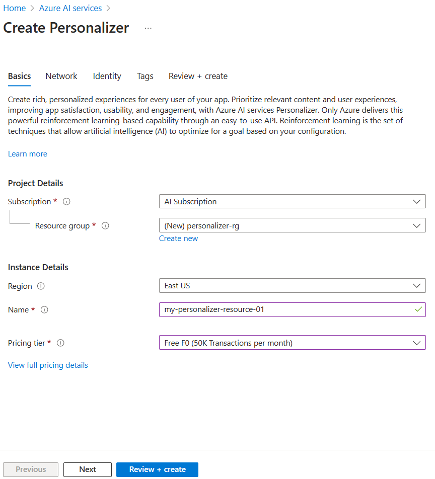
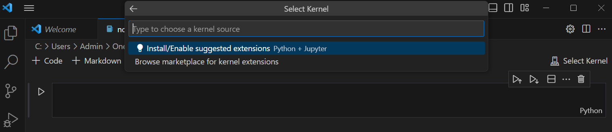
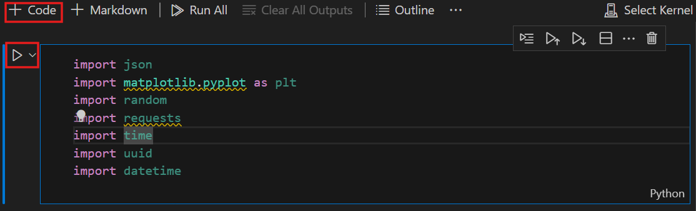

---
lab:
  title: استخدام AI Personalizer مع دفاتر ملاحظات Visual Studio Code لمحاكاة تكرار حلقي
---
> **مهم** اعتباراً من خريف 2023، لم يعد من الممكن إنشاء موارد Personalizer جديدة. استخدم هذا المستودع للرجوع إليه فقط إذا كان لديك مورد Personalizer موجود.

في هذا التمرين، ستستخدم Azure AI Personalizer مع دفاتر الملاحظات في Visual Studio Code لمحاكاة حلقة تعلم.

## إنشاء مورد Azure AI Personalizer باستخدام مدخل Azure

1. في مدخل Azure، ابحث عن **خدمات Azure AI**. ثم حدد **Create** ضمن **Personalizer** في قائمة النتائج.

   

1. حدد اشتراكك، وأدخل اسم مجموعة موارد، واسم المورد الخاص بك. مستوى الأسعار: اختر **F0 مجاني**.
1. حدد **مراجعة + إنشاء** لمراجعة اختياراتك، ثم حدد **إنشاء** لإنشاء موردك.
1. انتقل إلى مورد Azure AI Personalizer الذي تم إنشاؤه حديثاً، ثم في جزء المفاتيح ونقطة النهاية، انسخ **المفتاح** و**نقطة النهاية** والصقهما في مكان آمن للاستخدام لاحقاً:

   

1. حدد الإعداد في جزء التنقل، ثم قم بتعيين **وقت انتظار المكافأة** إلى **10 دقائق** (إذا لم يكن معيناً بالفعل)، ثم قم بتعيين **تكرار تحديث النموذج** إلى **15 ثانية**.
1. حدد **حفظ**.

## إعداد دفتر الملاحظات

1. في محرر Visual Studio Code، اضغط على **Ctrl+Shift+P** وحدد **إنشاء: دفتر ملاحظات Jupyter الجديد**.
1. احفظ الملف وقم بتسميته **دفتر ملاحظاتي** على جهازك.
1. الآن تحتاج إلى تثبيت الملحقات المطلوبة. في أعلى يمين دفتر الملاحظات، حدد **تحديد Kernel**. ثم حدد **تثبيت/تمكين الملحقات المقترحة**.

   

   > [!NOTE]
   > إذا كنت قد فعلت ذلك من قبل، فلن ترى هذا الخيار ويمكنك تخطي هذه الخطوة.

1. انتظر حتى يتم تثبيت الملحقات، ثم حدد **بيئات Python...** في القائمة المنسدلة التي تظهر.
1. ثم حدد أفضل بيئة مستحسنة.

## إعداد البيانات

لغرض هذا التمرين، سننشئ قائمة بالمستخدمين وقائمة بمنتجات القهوة التي يمكننا استخدامها كبيانات أساسية لـ Azure AI Personalizer.

1. انسخ التعليمة البرمجية JSON التالية في ملف فارغ واحفظ هذا الملف كـ `users.json` في نفس المجلد كملف دفتر الملاحظات.

   ```json
   {
     "Alice": {
       "Sunny": {
         "Morning": "Cold brew",
         "Afternoon": "Iced mocha",
         "Evening": "Cold brew"
       },
       "Rainy": {
         "Morning": "Latte",
         "Afternoon": "Cappucino",
         "Evening": "Latte"
       },
       "Snowy": {
         "Morning": "Cappucino",
         "Afternoon": "Cappucino",
         "Evening": "Cappucino"
       }
     },
     "Bob": {
       "Sunny": {
         "Morning": "Cappucino",
         "Afternoon": "Iced mocha",
         "Evening": "Cold brew"
       },
       "Rainy": {
         "Morning": "Latte",
         "Afternoon": "Latte",
         "Evening": "Latte"
       },
       "Snowy": {
         "Morning": "Iced mocha",
         "Afternoon": "Iced mocha",
         "Evening": "Iced mocha"
       }
     },
     "Cathy": {
       "Sunny": {
         "Morning": "Latte",
         "Afternoon": "Cold brew",
         "Evening": "Cappucino"
       },
       "Rainy": {
         "Morning": "Cappucino",
         "Afternoon": "Latte",
         "Evening": "Iced mocha"
       },
       "Snowy": {
         "Morning": "Cold brew",
         "Afternoon": "Iced mocha",
         "Evening": "Cappucino"
       }
     },
     "Dave": {
       "Sunny": {
         "Morning": "Iced mocha",
         "Afternoon": "Iced mocha",
         "Evening": "Iced mocha"
       },
       "Rainy": {
         "Morning": "Latte",
         "Afternoon": "Latte",
         "Evening": "Latte"
       },
       "Snowy": {
         "Morning": "Cappucino",
         "Afternoon": "Cappucino",
         "Evening": "Cappucino"
       }
     }
   }
   ```

1. بعد ذلك، انسخ التعليمات البرمجية التالية واحفظها في ملف يسمى `coffee.json`:

   ```json
   [
     {
       "id": "Cappucino",
       "features": [
         {
           "type": "hot",
           "origin": "kenya",
           "organic": "yes",
           "roast": "dark"
         }
       ]
     },
     {
       "id": "Cold brew",
       "features": [
         {
           "type": "cold",
           "origin": "brazil",
           "organic": "yes",
           "roast": "light"
         }
       ]
     },
     {
       "id": "Iced mocha",
       "features": [
         {
           "type": "cold",
           "origin": "ethiopia",
           "organic": "no",
           "roast": "light"
         }
       ]
     },
     {
       "id": "Latte",
       "features": [
         {
           "type": "hot",
           "origin": "brazil",
           "organic": "no",
           "roast": "dark"
         }
       ]
     }
   ]
   ```

1. انسخ التعليمة البرمجية التالية والصقها في الملف واحفظها كـ `example-rankrequest.json`:

   ```json
   {
     "contextFeatures": [],
     "actions": [],
     "excludedActions": [],
     "eventId": "",
     "deferActivation": false
   }
   ```

## تعيين نقطة النهاية والمفتاح

1. في الجزء العلوي من دفتر الملاحظات، أضف التعليمات البرمجية التالية لتضمين الوحدات النمطية المطلوبة:

   ```python
   import json
   import matplotlib.pyplot as plt
   import random
   import requests
   import time
   import uuid
   import datetime
   ```

1. حدد الخلية، ثم حدد زر التشغيل إلى يسار الخلية:

   

   > [!NOTE]
   > حدد زر التشغيل في كل مرة تقوم فيها بتعبئة خلية جديدة. إذا تمت مطالبتك بتثبيت حزمة ipykernel ، فحدد **تثبيت**.

1. حدد **+ Code** في أعلى دفتر الملاحظات لإنشاء خلية تعليمات برمجية جديدة. ثم أضف التعليمة البرمجية التالية:

   ```python
   # Replace 'personalization_base_url' and 'resource_key' with your valid endpoint values.
   personalization_base_url = "<your-endpoint>"
   resource_key = "<your-resource-key>"
   ```

1. استبدل قيمة **personalization_base_url** بنقطة النهاية المنسوخة، وقيمة **resource_key** بمفتاحك.

## تعقب التكرارات

1. بعد ذلك، يمكنك إنشاء التعليمات البرمجية من المساعدة على ملاحظة أوقات البدء والانتهاء من الوظائف التكرارية التي ستستخدمها لاحقاً. أضف التعليمات البرمجية التالية في خلية جديدة:

   ```python
   # Print out current datetime
   def currentDateTime():
       currentDT = datetime.datetime.now()
       print (str(currentDT))

   # ititialize variable for model's last modified date
   modelLastModified = ""

   def get_last_updated(currentModifiedDate):

       print('-----checking model')

       # get model properties
       response = requests.get(personalization_model_properties_url, headers = headers, params = None)

       print(response)
       print(response.json())

       # get lastModifiedTime
       lastModifiedTime = json.dumps(response.json()["lastModifiedTime"])

       if (currentModifiedDate != lastModifiedTime):
           currentModifiedDate = lastModifiedTime
           print(f'-----model updated: {lastModifiedTime}')
   ```

1. لا تنسَ تشغيل الخلية الجديدة بمجرد إضافة التعليمات البرمجية الجديدة.

## الحصول على تكوين السياسة والخدمة

1. بعد ذلك، ستحتاج إلى التحقق من صحة حالة الخدمة عن طريق الحصول على تكوين النهج والخدمة. للقيام بذلك، أضف التعليمات البرمجية التالية في خلية جديدة:

   ```python
   def get_service_settings():

       print('-----checking service settings')

       # get learning policy
       response = requests.get(personalization_model_policy_url, headers = headers, params = None)

       print(response)
       print(response.json())

       # get service settings
       response = requests.get(personalization_service_configuration_url, headers = headers, params = None)

       print(response)
       print(response.json())
   ```

1. تأكد من تشغيل خلية التعليمات البرمجية الجديدة.

تتكون التعليمات البرمجية من دالة تقوم بإجراء استدعاءين إلى واجهة برمجة تطبيقات الخدمة. عند استدعاء الدالة، تقوم بإرجاع قيم الخدمة باستخدام الاستجابة.

## إعداد عناوين URL للمكالمات وقراءة ملفات JSON

الآن ستضيف تعليمة برمجية إلى:

- إنشاء عناوين URL المستخدمة في استدعاءات REST
- تعيين عنوان الأمان باستخدام مفتاح مورد Personalizer
- تعيين القيمة الأولية العشوائية لمعرف حدث التصنيف
- القراءة في ملفات بيانات JSON
- تمت إزالة استدعاء أسلوب get_last_updated - نهج التعلم في إخراج المثال
- استدعاء أسلوب get_service_settings

1. للقيام بذلك، أضف التعليمات البرمجية التالية في خلية جديدة وشغّلها:

   ```python
   # build URLs
   personalization_rank_url = personalization_base_url + "personalizer/v1.0/rank"
   personalization_reward_url = personalization_base_url + "personalizer/v1.0/events/" #add "{eventId}/reward"
   personalization_model_properties_url = personalization_base_url + "personalizer/v1.0/model/properties"
   personalization_model_policy_url = personalization_base_url + "personalizer/v1.0/configurations/policy"
   personalization_service_configuration_url = personalization_base_url + "personalizer/v1.0/configurations/service"

   headers = {'Ocp-Apim-Subscription-Key' : resource_key, 'Content-Type': 'application/json'}

   # context
   users = "users.json"

   # action features
   coffee = "coffee.json"

   # empty JSON for Rank request
   requestpath = "example-rankrequest.json"

   # initialize random
   random.seed(time.time())

   userpref = None
   rankactionsjsonobj = None
   actionfeaturesobj = None

   with open(users) as handle:
       userpref = json.loads(handle.read())

   with open(coffee) as handle:
       actionfeaturesobj = json.loads(handle.read())

   with open(requestpath) as handle:
       rankactionsjsonobj = json.loads(handle.read())

   get_last_updated(modelLastModified)
   get_service_settings()

   print(f'User count {len(userpref)}')
   print(f'Coffee count {len(actionfeaturesobj)}')
   ```

1. يجب أن يرجع الاستدعاء استجابة مشابهة لما يلي:

   ```bash
   -----checking model
   <Response [200]>
   {'creationTime': '2023-09-22T14:58:45+00:00', 'lastModifiedTime': '2023-09-22T14:58:45+00:00'}
   -----model updated: "2023-09-22T14:58:45+00:00"
   -----checking service settings
   <Response [200]>
   {'name': '917554355a3347a1af3d2935d521426a', 'arguments': '--cb_explore_adf --epsilon 0.20000000298023224 --power_t 0 -l 0.001 --cb_type mtr -q ::'}
   <Response [200]>
   {'rewardWaitTime': 'PT10M', 'defaultReward': 0.0, 'rewardAggregation': 'earliest', 'explorationPercentage': 0.2, 'modelExportFrequency': 'PT15S', 'logRetentionDays': 90, 'lastConfigurationEditDate': '2021-01-01T00:00:00', 'learningMode': 'Online'}
   User count 4
   Coffee count 4
   ```

1. يجب أن يكون رمز الاستجابة `<Response [200]>` للإشارة إلى استدعاء ناجح. يجب أن يظهر **rewardWaitTime** على أنه 10 دقائق ويجب أن يكون **modelExportFrequency** 15 ثانية.

## إعداد مخطط بياني في مدخل Azure

تقدم التعليمات البرمجية الخاصة بك طلبات إلى واجهة برمجة التطبيقات. للحصول على مقياس جيد لطلباتك، يمكنك إنشاء مخطط قياسي في مدخل Azure:

1. في مدخل Azure، انتقل إلى مورد Azure AI Personalizer.

1. حدد **المقاييس** ضمن المراقبة في جزء التنقل.

   

1. تم تعيين مساحة الاسم **النطاق** و**مقياس** بالفعل لك. تحتاج فقط إلى تحديد **القياس** لإجراء **استدعاءات ناجحة** و**تجميع** **الإجمالي**.

1. غيّر عامل تصفية الوقت إلى آخر أربع ساعات.

## إنشاء معرفات أحداث فريدة

بعد ذلك، يمكنك إضافة تعليمة برمجية لإنشاء معرف فريد لكل استدعاء واجهة برمجة تطبيقات التصنيف. يمكنك استخدام هذا المعرف لتحديد معلومات استدعاء التصنيف والمكافأة للطلبات.

1. للقيام بذلك، أنشئ خلية تعليمات برمجية جديدة في دفتر الملاحظات وأضف ما يلي:

   ```python
   def add_event_id(rankjsonobj):
       eventid = uuid.uuid4().hex
       rankjsonobj["eventId"] = eventid
       return eventid
   ```

1. تذكر تشغيل خلية التعليمات البرمجية الجديدة.

> [!NOTE]
> في سيناريو حقيقي، يمكنك تعيين هذا إلى شيء مثل معرف المعاملة للشراء.

## احصل على مستخدم، والوقت من اليوم والطقس

يمكنك الآن إضافة دالة إلى:

- حدد مجموعة مستخدم فريد ووقت من اليوم والطقس.
- أضف هذه العناصر المحددة إلى كائن JSON الذي سيتم إرساله إلى واجهة برمجة تطبيقات التصنيف عبر استدعاء.

للقيام بذلك، أضف التعليمات البرمجية التالية في خلية جديدة وشغّلها:

```python
def add_random_user_and_contextfeatures(namesoption, weatheropt, timeofdayopt, rankjsonobj):
    name = namesoption[random.randint(0,3)]
    weather = weatheropt[random.randint(0,2)]
    timeofday = timeofdayopt[random.randint(0,2)]
    rankjsonobj['contextFeatures'] = [{'timeofday': timeofday, 'weather': weather, 'name': name}]
    return [name, weather, timeofday]
```

## إضافة بيانات القهوة

بعد ذلك، يمكنك إنشاء دالة للحصول على قائمة كاملة بمنتجات القهوة إلى كائن JSON الذي ترسله بعد ذلك إلى واجهة برمجة تطبيقات التصنيف.

للقيام بذلك، أضف التعليمات البرمجية التالية في خلية جديدة وشغّلها:

```python
def add_action_features(rankjsonobj):
    rankjsonobj["actions"] = actionfeaturesobj
```

## مقارنة التنبؤات مع تفضيلات المستخدم المعروفة

يمكنك بعد ذلك إنشاء دالة لمقارنة تفضيل المستخدم لقهوة معينة، مع مراعاة تفاصيل مثل الطقس والوقت من اليوم، مع ما يقترحه Azure AI Personalizer.

1. للقيام بذلك، قم بإنشاء خلية جديدة، وأضف التعليمات البرمجية التالية، وقم بتشغيلها:

   ```python
   def get_reward_from_simulated_data(name, weather, timeofday, prediction):
       if(userpref[name][weather][timeofday] == str(prediction)):
           return 1
       return 0
   ```

1. تهدف هذه الدالة إلى التشغيل بعد كل مرة يتم فيها استدعاء واجهة برمجة تطبيقات التصنيف. إذا تطابق الاقتراح، يتم إرجاع درجة `1` في الاستجابة. إذا لم يتطابق، فسيتم إرجاع `0`.

## إنشاء تكرار حلقي مع استدعاءات إلى واجهات برمجة تطبيقات التصنيف والمكافأة

تستخدم الخلايا السابقة لإعداد دفتر الملاحظات للتكرار الحلقي. ستقوم الآن بتكوين التكرار الحلقي الخاص بك. تغطي الحلقة النص الأساسي للعمل في دفتر ملاحظاتك. يحصل على مستخدم عشوائي، ويحصل على قائمة القهوة، ويرسلهما إلى واجهة برمجة تطبيقات التصنيف. يقارن التنبؤ من Azure AI Personalizer مع التفضيلات المعروفة لهذا المستخدم، ثم يرسل المكافأة مرة أخرى إلى Azure AI Personalizer.

لإنشاء التكرار الحلقي، أضف التعليمات البرمجية التالية إلى خلية جديدة وقم بتشغيلها:

```python
def iterations(n, modelCheck, jsonFormat):

    i = 1

    # default reward value - assumes failed prediction
    reward = 0

    # Print out dateTime
    currentDateTime()

    # collect results to aggregate in graph
    total = 0
    rewards = []
    count = []

    # default list of user, weather, time of day
    namesopt = ['Alice', 'Bob', 'Cathy', 'Dave']
    weatheropt = ['Sunny', 'Rainy', 'Snowy']
    timeofdayopt = ['Morning', 'Afternoon', 'Evening']


    while(i <= n):

        # create unique id to associate with an event
        eventid = add_event_id(jsonFormat)

        # generate a random sample
        [name, weather, timeofday] = add_random_user_and_contextfeatures(namesopt, weatheropt, timeofdayopt, jsonFormat)

        # add action features to rank
        add_action_features(jsonFormat)

        # show JSON to send to Rank
        print('To: ', jsonFormat)

        # choose an action - get prediction from Personalizer
        response = requests.post(personalization_rank_url, headers = headers, params = None, json = jsonFormat)

        # show Rank prediction
        print ('From: ',response.json())

        # compare personalization service recommendation with the simulated data to generate a reward value
        prediction = json.dumps(response.json()["rewardActionId"]).replace('"','')
        reward = get_reward_from_simulated_data(name, weather, timeofday, prediction)*10

        # show result for iteration
        print(f'   {i} {currentDateTime()} {name} {weather} {timeofday} {prediction} {reward}')

        # send the reward to the service
        response = requests.post(personalization_reward_url + eventid + "/reward", headers = headers, params= None, json = { "value" : reward })

        # for every N rank requests, compute total correct  total
        total =  total + reward

        # every N iteration, get last updated model date and time
        if(i % modelCheck == 0):

            print("**** 10% of loop found")

            get_last_updated(modelLastModified)

        # aggregate so chart is easier to read
        if(i % 10 == 0):
            rewards.append( total)
            count.append(i)
            total = 0

        i = i + 1

    # Print out dateTime
    currentDateTime()

    return [count, rewards]
```

فيما يلي مثال على بنية JSON التي ترسلها الدالة إلى واجهة برمجة تطبيقات التصنيف:

```python
{
    'contextFeatures':[
      {
          'timeofday':'Evening',
          'weather':'Snowy',
          'name':'Alice'
      }
    ],
    'actions':[
      {
          'id':'Cappucino',
          'features':[
            {
                'type':'hot',
                'origin':'kenya',
                'organic':'yes',
                'roast':'dark'
            }
          ]
      }
        ...rest of the coffee list
    ],
    'excludedActions':[

    ],
    'eventId':'b5c4ef3e8c434f358382b04be8963f62',
    'deferActivation':False
}
```

ستستجيب واجهة برمجة تطبيقات التصنيف باستجابة منظمة على النحو التالي:

```python
{
    'ranking': [
        {'id': 'Latte', 'probability': 0.85 },
        {'id': 'Iced mocha', 'probability': 0.05 },
        {'id': 'Cappucino', 'probability': 0.05 },
        {'id': 'Cold brew', 'probability': 0.05 }
    ],
    'eventId': '5001bcfe3bb542a1a238e6d18d57f2d2',
    'rewardActionId': 'Latte'
}
```

سيعرض كل تكرار حلقي المستخدم المحدد عشوائياً والطقس والوقت من اليوم، والمكافأة المحددة بشكل مناسب:

```bash
1 Alice Rainy Morning Latte 1
```

مكافأة `1` تعني أن مورد Azure AI Personalizer الخاص بك قد حدد نوع القهوة الصحيح لهذا المزيج المعين من المستخدم والطقس والوقت من اليوم.

## تشغيل التكرار الحلقي وعرض نتائج المخطط

يحتاج Azure AI Personalizer إلى بضعة آلاف من الاستدعاءات إلى واجهة برمجة تطبيقات التصنيف وواجهة برمجة تطبيقات المكافأة لإنشاء نموذج. ستقوم بتشغيل التكرار الحلقي الخاص بك لعدد معين من التكرارات.

1. للقيام بذلك، قم بإنشاء خلية تعليمة برمجية جديدة، وأضف التعليمات البرمجية التالية، وقم بتشغيلها:

   ```python
   # max iterations
   num_requests = 150

   # check last mod date N% of time - currently 10%
   lastModCheck = int(num_requests * .10)

   jsonTemplate = rankactionsjsonobj

   # main iterations
   [count, rewards] = iterations(num_requests, lastModCheck, jsonTemplate)
   ```

1. قم بتحديث مخطط المقاييس في مدخل Azure كل ذلك في كثير من الأحيان لمشاهدة إجمالي الاستدعاءات إلى الخدمة.
1. يمكن تشغيل هذا الحدث لفترة من الوقت. لا تغلق دفتر الملاحظات حتى ينتهي. عندما يتم إجراء التكرار الحلقي على نحو 20000 استدعاء - استدعاء تصنيف ومكافأة لكل تكرار للحلقة - ستنتهي الحلقة.

1. بعد ذلك، يمكنك إنشاء مخطط في دفتر الملاحظات لرسم دفعات أحداث التصنيف، وعدد التوصيات الصحيحة التي تم تقديمها لكل دفعة. للقيام بذلك، أضف التعليمات البرمجية التالية في خلية جديدة وشغّلها:

   ```python
   def createChart(x, y):
       plt.plot(x, y)
       plt.xlabel("Batch of rank events")
       plt.ylabel("Correct recommendations per batch")
       plt.show()

   createChart(count,rewards)
   ```

1. سيقوم دفتر الملاحظات بإنشاء مخطط:

   

> **Tip:** من الناحية المثالية، بمجرد انتهاء الاختبار، يجب أن تقدم الحلقة الخاصة بك في المتوسط توصيات صحيحة بمعدل 100 بالمائة ناقص قيمة الاستكشاف (وهي 20% بشكل افتراضي)، لذلك فإن 80% هو معدلك المستهدف هنا. طريقة للوصول إلى هذا هو زيادة التكرارات إلى 10000 على الأقل.

يعرض المخطط مدى نجاح النموذج الخاص بك استناداً إلى نهج التعلم الافتراضي. يوضح هذا المخطط أنه يمكن تحسين نهج التعلم. يمكنك القيام بذلك عن طريق تغيير النهج بعد تشغيل التقييمات.

## تشغيل التقييم دون اتصال

> [!NOTE]
> هذا القسم في هذا التمرين اختياري لأنه لا يمكن تنفيذه إلا بعد إجراء 50000 استدعاء على الأقل لمورد Azure AI Personalizer. ولكن يمكنك العودة إلى هذا القسم إذا تلقيت في مرحلة ما 50000 استدعاء مقابل موردك.

يمكنك تشغيل تقييم دون اتصال للعثور على نهج تعلم أفضل لمورد Azure AI Personalizer مع 50000 استدعاء على الأقل.

1. في مدخل Azure، انتقل إلى جزء تحسين مورد Azure AI Personalizer وحدد **إنشاء تقييم**.
1. قم بتوفير اسم تقييم، وحدد نطاق تاريخ البدء والانتهاء لتقييم التكرار الحلقي. يجب أن يتضمن نطاق التاريخ الخاص بك الأيام التي تركز عليها لتقييمك فقط:

   

1. حدد **بدء التقييم** لبدء التقييم.

1. عند اكتمال التقييم، حدده من قائمة التقييمات في جزء التحسين. ثم راجع أداء نُهج التعلم الخاصة بك استناداً إلى تفاصيل مثل متوسط المكافأة وفواصل الثقة والمزيد:

   

1. سترى بعض النُهج بما في ذلك:

   - **عبر الإنترنت** - نهج Azure AI Personalizer الحالي.
   - **خط الأساس1** - نهج خط الأساس لتطبيقك
   - **BaselineRand** - نهج اتخاذ إجراءات عشوائية.
   - **Inter-len#** أو **Hyper#** - النُهج التي تم إنشاؤها بواسطة اكتشاف التحسين.

1. حدد **تطبيق** على النهج الذي يحسن النموذج على أفضل نحو.

## تنظيف الموارد

إذا كنت لا تستخدم موارد Azure التي أنشأتها في هذا المختبر لوحدات التدريب الأخرى، فيمكنك حذفها لتجنب تكبد المزيد من الرسوم.

1. افتح مدخل Azure في `https://portal.azure.com`، وفي شريط البحث العلوي، ابحث عن الموارد التي أنشأتها في هذا المختبر.

2. في صفحة المورد، حدد **حذف** واتبع الإرشادات لحذف المورد. بدلاً من ذلك، يمكنك حذف مجموعة الموارد بأكملها لتنظيف جميع الموارد في الوقت نفسه.
